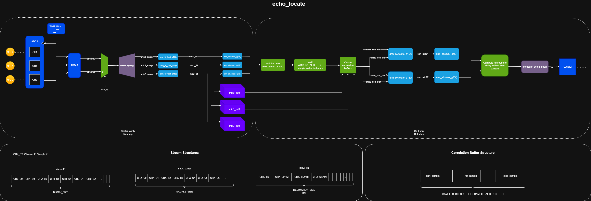

# Firmware

## Overview (initial + Revision 1.1)
The general process for computing the origin of a sound event is as follows... (updated)
1. Wait for DMA interrupt indicating stream complete
2. Splice DMA stream into three separate microphone streams
3. Filter raw microphone streams
4. Copy filtered streams to buffers
5. Find peaks in microphone streams
6. If a stream has a peak that exceeds the threshold, indicate detection
7. After all three microphones detected a peak above threshold, ensure they fall in a reasonable window
8. Take the earliest peak as a reference sample
9. Copy samples from right before reference sample to the farthest sample peak possible in a correlation buffer
10. Cross correlate mic1 and mic2 correlation buffers with mic0 to get delays
11. Use nonlinear least squares to estimate sound origin

## Initial Design
The original process before using the embedded FPU involved finding the highest peak in all three microphone stream samples within a timeout window, then computing microphone delays manually. This process was incredibly rudimentary but was intended to get a functional model. After discovering the CMSIS DSP library, changes were made.

## Revision 1.1
The second version involved using the embedded FPU to again find the highest peaks within a certain window, but also disregarding consecutive peaks on one microphone stream while waiting for other peaks in different microphone streams. After all three microphone peaks have been detected within a valid window, a correlation buffer is filled using a couple samples before the first detected peak, then several hundred samples after to ensure the longest valid distance can be detected. Cross correlation is run, and microphone delays 2 and 3 are computed, then fed into the NLLS algorithm. 

## Revision 2.0
The triangulator works ok with some events, but is unreliable and gives wrong estimates. In the previous two revisions, a simultaneous ADC was not available, so each consecutive sample was taken a couple microseconds. This small skew leads to huge angular errors impacting cross correlation and TDoA. To prevent this, an FPGA with three digital ADC chips (MCP3002) will be used to simultaneously sample the ADCs, transmitting the buffers over SPI to the STM32F401RE. There were a couple of options including buying an STM32 with 3 different ADC units and triggering all using the same timer or buying a dedicated simultaneous sampling ADC (expensive), but I went with this because I have these parts on hand and its good exercise.

### Overview
1. Simultaneously sample N samples using iCE40HX8K FPGA
2. Bandpass FIR stream per microphone (FPGA)
3. Send stream over SPI to STM32F401RE
4. Wait for DMA buffer to fill
5. Envelope + Lowpass on STM32
6. Detect peaks and extract sample windows
7. GCC-PHAT
8. Solve using NLLS/linear variant to estimate sound origin