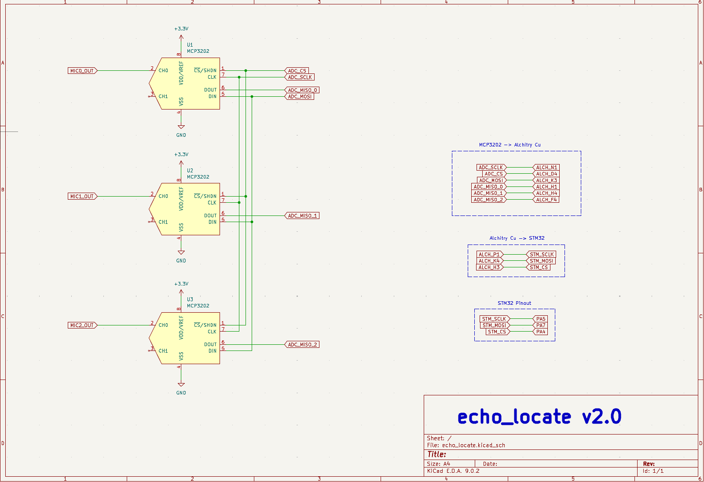

# Hardware

## Overview
The constraints needed to sample a microphone at 40kHz for this particular case involve
1. Low-pass filter (fc = 20kHz)
2. DC offset (ideally at Vcc/2)
3. Large gain (40dB+) to capture weak sonic events

## Initial Design
The initial design I chose met all of the constraints above using an LM741 op-amp with additional circuitry. The schematic comes from https://cdn.sparkfun.com/assets/7/5/6/e/d/SparkFun_Analog_MEMS_Microphone_Breakout_SPH8878LR5H-1.pdf, with a gain of 64, DC offset of Vcc/2, and frequency response in the range [7.2Hz, 19.7kHz].

LM741 circuit

During testing, the electret microphones worked well with the filter, but it was very susceptible to large changes in volume. A snap would results in a (relatively) accurate or reasonable measurement, while clapping would result in impossible or absurd measurements. To fix this problem, I decided to change the microphones.

## Revision
The new microphones I selected were the MAX9814 AGC microphones from Adafruit. These mics were similar in function to that used in the previous version, but had adjustable gain, automatic gain control, and configurable attack/release. The automatic gain control enables low-energy signals to be amplified to the same level as high-energy signals. From the ADC's perspective, a large noise and small noise result in roughly the same voltage output. With a frequency range of about 0-20kHz and a 40dB gain selected, these mics performed well enough for my needs.

